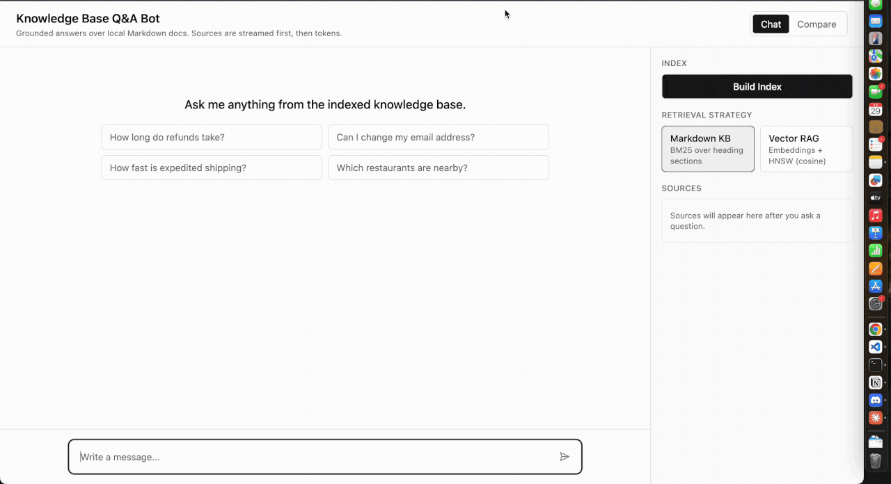

<p align="right"><strong>English</strong> · <a href="./README.zh-TW.md">繁體中文</a></p>

# Knowledge Base Q&A Bot

A self-hostable Q&A chatbot over a local Markdown knowledge base. The server retrieves
grounded context with **two interchangeable strategies** — Markdown KB (BM25) and Vector
RAG (HNSW over OpenAI embeddings) — and streams the answer with inline citations.
The web client is built on [assistant-ui](https://www.assistant-ui.com/) and the
[Vercel AI SDK v6](https://ai-sdk.dev/) UI message stream protocol.



> Ask a question → sources stream in first, then the cited answer. Follow-ups resolve in context, out-of-scope questions get an honest "I cannot confirm" — never a hallucination — and the Compare tab runs both retrieval strategies on the same question, side by side.

## Quickstart

> **Prerequisites:** Node.js 20+ and an `OPENAI_API_KEY`. See [Prerequisites](#prerequisites) for optional env vars.

```bash
export OPENAI_API_KEY="sk-..."
npm install
npm run dev:server   # terminal 1 — Hono on :8000
npm run dev:web      # terminal 2 — Vite on :5173 (proxies to :8000)
```

Then open <http://localhost:5173>. On first load the indexes are empty — click
**Build Index** in the sidebar (or `POST /build-index`) before asking questions.

## Features

- **Four retrieval strategies** — Markdown KB (BM25), Vector RAG (HNSW), **Hybrid (the default)** which fuses both via Reciprocal Rank Fusion, and **LLM Index** which lets the model pick sections straight from the wiki catalog; switchable per query, with a side-by-side `/compare` view ([why](#why-two-retrieval-strategies)).
- **Grounded answers with inline citations**, streamed token-by-token over the AI SDK v6 [streaming protocol](#streaming-protocol).
- **Honest "I cannot confirm"** instead of hallucinating when nothing matches ([why](#why-explicit-i-cannot-confirm)).
- **Conversation memory** that rewrites follow-ups into standalone queries ([details](#conversation-memory-follow-up-questions)).
- **Persist & browse** — [file reviewed answers](#answer-filing-persist-reviewed-qa) back into the KB and generate a [browsable wiki index](#wiki-index-browsable-topic-list).
- **Source-authority weighting** — declare a document's trust level in front matter (`source_type: policy | faq | transcript | …`); at equal relevance, authoritative sources are re-ranked ahead of casual ones, without overriding a clearly better match ([details](#retrieval-pipeline)).
- **Incremental indexing** — `/build-index` re-embeds only the files whose content changed (per-file SHA-256), reusing the existing vectors for the rest.
- **Grounding verifier** — after answering, a second LLM pass checks each claim against the retrieved sources and flags anything unsupported ([why](#why-explicit-i-cannot-confirm)).
- **Injection guard & citation safety** — role-hijack / prompt-leak queries are refused before retrieval, and answer citations are validated against the retrieved set (hallucinated ones stripped, missing ones backfilled).
- **Dream memory consolidation** — a self-improving loop: repeatedly-asked, grounded questions are clustered and distilled into canonical FAQ entries that get promoted into the indexed KB ([details](#dream-memory-consolidation-self-improving-retrieval)).
- **Feedback → eval loop** — thumbs-down an answer and pick the source it should have used; that miss becomes a permanent answer-eval regression case ([details](#feedback--eval-loop)).
- **End-to-end type safety** (Hono RPC), a [paraphrase eval harness](#paraphrase-eval-retrieval-robustness), and Playwright + unit [tests](#tests).

**Contents:** [How to use](#1--how-to-use) · [Advanced usage](#2--advanced-usage) · [How it works](#3--how-it-works) · [Design decisions](#4--design-decisions)

---

## 1 · How to use

### Prerequisites

- Node.js 20+ (tested on 22.11)
- An `OPENAI_API_KEY` exported in your shell. Without it `/chat`, `/chat/stream`,
  `/compare`, and embedding generation during `/build-index` will fail.

```bash
export OPENAI_API_KEY="sk-..."
```

Optional environment variables:

| Variable                 | Default                   | Purpose                                |
|--------------------------|---------------------------|----------------------------------------|
| `OPENAI_MODEL`           | `gpt-4o-mini`             | Chat completion model                  |
| `OPENAI_EMBEDDING_MODEL` | `text-embedding-3-small`  | Embedding model for the vector index   |
| `PORT`                   | `8000`                    | Server port                            |

### Try it with curl

```bash
# Health
curl http://localhost:8000/health
# {"status":"ok"}

# Build both indexes from docs/*.md
curl -X POST http://localhost:8000/build-index
# {"files_indexed":3,"sections_indexed":12,"chunks_indexed":12,"vector_files_indexed":3}

# One-shot Q&A (BM25 by default)
curl -X POST http://localhost:8000/chat \
  -H 'Content-Type: application/json' \
  -d '{"query":"How long do refunds take?"}'
```

<details>
<summary>More curl examples — vector strategy, honest fallback, streaming, compare</summary>

```bash
# Same query, vector strategy
curl -X POST http://localhost:8000/chat \
  -H 'Content-Type: application/json' \
  -d '{"query":"Can I change my email address?","strategy":"vector_rag"}'

# Out-of-scope → honest fallback
curl -X POST http://localhost:8000/chat \
  -H 'Content-Type: application/json' \
  -d '{"query":"Which restaurants are nearby?"}'
# "I cannot confirm from the knowledge base."

# Streaming (AI SDK v6 UI message stream)
curl -N -X POST http://localhost:8000/chat/stream \
  -H 'Content-Type: application/json' \
  -d '{"query":"How long do refunds take?"}'

# Side-by-side compare
curl -X POST http://localhost:8000/compare \
  -H 'Content-Type: application/json' \
  -d '{"query":"How long do refunds take?"}'
```

</details>

### Scripts

```bash
npm run dev:server   # Hono backend, :8000
npm run dev:web      # Vite frontend, :5173
npm run import:raw   # normalize raw/*.txt|*.html into docs/*.md
npm run generate:wiki # regenerate wiki/index.md from .kb/index.json
npm run eval         # paraphrase retrieval eval (BM25 vs vector)
npm run eval:answer  # answer-level eval: citations, decision, grounding (needs OPENAI_API_KEY)
npm run eval:from-feedback # turn 👎 feedback into regression eval cases
npm run build        # tsc -b + vite build
npm run test:unit    # node:test unit tests (raw→Markdown helpers)
npm run test:e2e     # Playwright suite (auto-starts both dev servers)
```

---

## 2 · Advanced usage

### Import raw sources (optional)

The knowledge base is canonical Markdown under `docs/`. To bring in plain-text or
HTML sources, drop them in `raw/` and normalize them into `docs/*.md`:

```bash
npm run import:raw              # raw/*.txt | raw/*.html -> docs/*.md
npm run import:raw -- --force   # overwrite docs that already exist
```

Each converted file gets YAML front matter recording its original `source`
filename, and a heading is guaranteed so the indexers always pick it up. The
script only normalizes — rebuild afterwards with **Build Index** or
`POST /build-index`.

### Wiki index (browsable topic list)

`wiki/index.md` is a human- and agent-browsable table of contents generated from
`.kb/index.json` — one `##` per source doc, with sub-sections nested by heading depth and
each entry linking back to `../docs/<file>#<anchor>`. It lets a reader (or an agent) see
what the knowledge base covers without calling the API.

It is regenerated automatically at the end of every `POST /build-index`. To rebuild it on
its own from the existing index (no re-indexing, no API key):

```bash
npm run generate:wiki
```

```text
# Knowledge Base Index

**5 documents · 17 sections**

## refund_policy.md

- [Refund Policy](../docs/refund_policy.md#refund-policy)
  - [Cancellation Window](../docs/refund_policy.md#cancellation-window)
  - [Refund Timeline](../docs/refund_policy.md#refund-timeline)
```

The anchors match the slugs the indexer assigns to each heading, so the links resolve in any
Markdown viewer.

### Answer filing (persist reviewed Q&A)

Once you've reviewed a `/chat` answer and it's good, file it back into the knowledge base.
`POST /file-answer` takes the approved result and writes a source-grounded Markdown file to
`wiki/answers/<slug>.md`, preserving citations: inline `[file.md#section]` markers in the
answer become links back to `docs/`, and every retrieved source is listed with its score. It
also regenerates `wiki/answers/index.md` so filed answers are browsable.

```bash
# Review a /chat result, then file the approved answer with its sources
curl -X POST http://localhost:8000/file-answer \
  -H 'Content-Type: application/json' \
  -d '{
    "query": "How long do refunds take?",
    "answer": "Refunds arrive in 5-7 business days [refund_policy.md#refund-timeline].",
    "sources": [{"source":"refund_policy.md#refund-timeline","heading":"Refund Policy > Refund timeline","score":2.152,"content":"..."}]
  }'
# {"filed":true,"slug":"how-long-do-refunds-take","file":"wiki/answers/how-long-do-refunds-take.md"}
```

The endpoint persists exactly what you reviewed — it does not re-run retrieval or the LLM.

### Paraphrase eval (retrieval robustness)

`npm run eval` runs a curated set of paraphrased queries — the *same* intent phrased
different ways — through both strategies' retrieval layer (no LLM answer) and reports
whether each strategy still surfaces the expected section. It makes the two failure
modes concrete: BM25 misses synonyms ("money back" never matches the word "refund"),
while vector search can return a semantically related but wrong section.

```bash
npm run eval   # build the index first: POST /build-index, or ensure .kb/ exists
```

The BM25 column needs no API key; the vector column embeds each query, so it needs
`OPENAI_API_KEY` (without it those cells degrade to an error and the BM25 column
still prints).

```text
▸ refund timing   →  expect: refund_policy.md#refund-timeline
   "How long do refunds take?"
       BM25    ✅ refund_policy.md#refund-timeline  (2.152)
       Vector  ✅ refund_policy.md#refund-timeline  (0.683)
   "When will I get my money back?"
       BM25    ⚠️  cannot-confirm (below threshold)
       Vector  ✅ refund_policy.md#refund-timeline  (0.466)

Summary (out of 15 paraphrases)
   Markdown KB (BM25):   hit@1 10/15    hit@3 11/15
   Vector RAG:           hit@1 14/15    hit@3 15/15
```

Legend: ✅ expected is top-1, 🔸 expected in top-3, ❌ wrong section. The probes live
in [`apps/server/src/eval/paraphrase.ts`](apps/server/src/eval/paraphrase.ts) — add
intents and paraphrases there.

### Answer-level eval (citations, decision, grounding)

`npm run eval:answer` runs the **full** pipeline (retrieve → answer → grounding verify)
over a curated case set and scores axes the retrieval eval is blind to — separating
*"was the right section retrieved"* from *"did the answer actually cite it"* and *"did it
hallucinate a citation"*:

- **retrieval_recall / top1_hit** — expected section retrieved / ranked first.
- **citation_recall** — of the expected sources, how many the answer cited.
- **citation_precision** — of what the answer cited, how much was actually retrieved
  (< 1 ⇒ a hallucinated citation).
- **decision_match** — answered vs. correctly refused; the case set includes out-of-scope
  questions that *must* return "I cannot confirm".
- **answer_grounded** — the post-answer grounding verdict.

```text
Summary
   Decision match (all):     13/14
   — answer cases —
   Retrieval recall (avg):   1.00
   Top-1 hit rate:           7/9
   Citation recall (avg):    0.89
   Citation precision (avg): 1.00
   Grounded rate:            8/9
   — refusal cases —
   Correctly refused:        5/5
```

It needs `OPENAI_API_KEY` (every case runs `answerQuery`). Cases live in
[`apps/server/src/eval/cases.ts`](apps/server/src/eval/cases.ts); the metric math is pure and
unit-tested in [`metrics.test.ts`](apps/server/src/eval/metrics.test.ts).

### Feedback → eval loop

Closes the production→regression loop: rate an answer in the UI, and a thumbs-down becomes a
new eval case. The sidebar **feedback panel** shows 👍 / 👎 for the latest answer; 👎 reveals a
picker of the retrieved sources (plus "None — it should have refused") so you record *which
source the answer should have used*. `POST /feedback` appends the rating to
`.kb/feedback/feedback.jsonl`.

```bash
npm run eval:from-feedback   # read the feedback log → write eval/cases.gen.json
```

`eval:from-feedback` turns each 👎 into a regression case (`expected_source` → an "answer" case
expecting that section; "should have refused" → a `cannot_confirm` case), deduped by query.
`npm run eval:answer` loads `cases.gen.json` alongside the curated cases, so a real miss is
scored on every future run. The committed corpus starts empty; the feedback log stays local to
`.kb/`.

### Conversation memory (follow-up questions)

`/chat/stream` accepts the full `messages` array, so a follow-up is read in the context of
the conversation. Before retrieval, the server rewrites the latest question into a standalone
query using the recent turns — resolving pronouns and implied subjects ("How do I start
**one**?" → "How do I start a refund?") — and then retrieves with the rewritten query. Memory
only shapes *what gets retrieved*; the answer is still grounded solely in the retrieved
sources and follows the same citation rules.

The rewrite runs only when there is prior history — the first turn is passed through
untouched — and it fails open: if the rewrite call errors, the original question is used, so
chat never breaks. When the question is rewritten, the stream emits an extra `data-rewrite`
part and the UI shows it as an "Interpreted as …" line above the sources panel.

```bash
curl -s http://localhost:8000/chat/stream -H 'content-type: application/json' -d '{
  "strategy": "markdown_kb",
  "messages": [
    {"role":"user","parts":[{"type":"text","text":"How long do refunds take?"}]},
    {"role":"assistant","parts":[{"type":"text","text":"Refunds take 5-7 business days [refund_policy.md#refund-timeline]."}]},
    {"role":"user","parts":[{"type":"text","text":"How do I start one?"}]}
  ]
}'
# ... data: {"type":"data-rewrite","id":"rewrite","data":{"original":"How do I start one?","rewritten":"How do I start a refund?"}}
```

The rewrite needs `OPENAI_API_KEY` (one small extra call per follow-up); the first turn skips
it, so single-turn behavior is unchanged.

### Dream memory consolidation (self-improving retrieval)

Every answered turn is logged to `.kb/dream/turns.jsonl`, tagged with the
[grounding verdict](#features) (`VALID` / `DEFAULT` / `REJECTED`). `POST /dream` (or
`npm run dream`) then runs a consolidation pass: it embeds the **grounded, repeatedly-asked**
questions, clusters paraphrases by cosine similarity (≥ 0.85, single-link), keeps clusters
asked **≥ 3 times**, and distills each into one canonical Q&A. The result is promoted into
`docs/_consolidated.md` (tagged `source_type: faq`) and the indexes are rebuilt — so the next
time that question is asked, it hits a first-class, retrievable KB section instead of being
recomputed from scratch. Frequently-asked, vetted answers literally become part of the corpus.

```bash
curl -X POST http://localhost:8000/dream
# {"scanned":42,"valid":31,"clusters":3,"promoted":[{"slug":"how-long-do-refunds-take","question":"How long do refunds take?","occurrences":8}],"skipped":0,"reindexed":{"sections":19,"chunks":16}}
```

It is **idempotent** — `state.json` records each promoted cluster's fingerprint, so a re-run
with no new clusters promotes nothing and leaves the doc untouched — and **fail-open**: a
cluster whose distillation errors or returns malformed JSON is skipped, never written. Needs
`OPENAI_API_KEY` (embeddings + one distill call per new cluster). Logged queries stay local
to `.kb/`.

---

## 3 · How it works

```
┌────────────┐   POST /chat/stream    ┌──────────────┐
│  React +   │ ─────────────────────▶ │  Hono server │
│ assistant- │                        │  (Node.js)   │
│    ui      │  data-sources part     │              │
│            │  ◀── text-* parts ──── │   strategies │
└────────────┘                        └──────┬───────┘
                                             │
                                  ┌──────────┴──────────┐
                                  ▼                     ▼
                         markdown_kb (BM25)     vector_rag (HNSW
                         heading sections        + embeddings)
```

### Repository layout

```
.
├── apps/
│   ├── server/                  Hono backend on :8000
│   │   └── src/
│   │       ├── app.ts           chained Hono builder; exports AppType for RPC
│   │       ├── index.ts         startup + serve
│   │       ├── routes/          /health, /build-index, /chat, /chat/stream, /compare
│   │       ├── strategies/      markdown-kb (BM25), vector-rag (HNSW), shared retrieve
│   │       ├── scripts/         import-raw (raw→docs) + generate-wiki (index→wiki)
│   │       └── eval/            paraphrase: BM25 vs vector retrieval robustness
│   ├── web/                     React + Vite + Tailwind + assistant-ui on :5173
│   │   └── src/lib/api.ts       typed Hono RPC client via hc<AppType>
│   └── e2e/                     Playwright suite; auto-starts dev servers via webServer
├── packages/
│   └── shared/                  Strategy, SourceInfo, ChatResult, IndexResult
├── raw/                         drop-zone for .txt / .html sources to import
├── docs/                        canonical Markdown KB (refund_policy, account_help, ...)
├── wiki/                        generated, gitignored: index.md + answers/ (filed Q&A)
├── .kb/                         generated indexes (gitignored)
│   ├── index.json               BM25 sections + stats
│   └── vector_index/            HNSW binary + metadata.json
└── tsconfig.json                strict shared root config; apps extend it
```

### API surface

| Method | Path            | Body                                                          | Response                                                  |
|--------|-----------------|---------------------------------------------------------------|-----------------------------------------------------------|
| GET    | `/health`       | —                                                             | `{ "status": "ok" }`                                      |
| POST   | `/build-index`  | —                                                             | `{ files_indexed, sections_indexed, chunks_indexed, ... }`|
| POST   | `/chat`         | `{ query, strategy?: "markdown_kb" \| "vector_rag" \| "hybrid" \| "llm_index" }` | `{ answer, sources, strategy }` |
| POST   | `/chat/stream`  | `{ query, strategy? }` or `{ messages: [...], strategy? }`    | AI SDK UI message stream (SSE)                            |
| POST   | `/compare`      | `{ query }`                                                   | `{ markdown_kb: {...}, vector_rag: {...}, llm_index: {...} }` |
| POST   | `/file-answer`  | `{ query, answer, sources?, strategy? }`                     | `{ filed, slug, file }`                                   |

### Retrieval pipeline

For each query:

1. **Tokenise & retrieve** using the selected strategy.
   - **Markdown KB**: parse `docs/*.md` into heading sections, score with BM25, return
     the top-k sections.
   - **Vector RAG**: same parsing, but split sections longer than 1500 chars (200-char
     overlap), embed with `text-embedding-3-small`, search the HNSW index by cosine
     similarity.
2. **Threshold check**. BM25 ≥ 0.5 or cosine ≥ 0.3 — anything below is treated as
   "no confident match"; the server short-circuits to `"I cannot confirm from the
   knowledge base."` without calling the LLM.
3. **Authority re-rank**. Each candidate's score is multiplied by `(1 + priority × 0.05)`,
   where `priority` comes from the file's `source_type` front matter (`policy`/`official` = 3,
   `faq`/`guide` = 2, untagged = 1, `transcript`/`chat`/`qa` = 0). The relative factor is
   scale-invariant across BM25, cosine, and RRF; the top-k is then taken. This lets an
   official page win a near-tie against a transcript without overriding a clearly more
   relevant section. (Skipped for LLM Index, whose picks have no comparable score.)
4. **Prompt assembly**. Top hits are joined with their heading path
   (`refund_policy.md > Refund Policy > Refund timeline`) and inserted into the
   system + user prompt template.
5. **Generate**. `streamText` with the assembled prompt, streamed back as UI message
   parts.

### Streaming protocol

`/chat/stream` returns a Vercel AI SDK v6 UI message stream. The order is deliberate:

```
data: {"type":"data-sources","id":"sources","data":{"strategy":"markdown_kb","sources":[...]}}
data: {"type":"start","messageId":"..."}
data: {"type":"text-start","id":"..."}
data: {"type":"text-delta","id":"...","delta":"Refunds "}
data: {"type":"text-delta","id":"...","delta":"typically arrive in "}
...
data: {"type":"finish"}
```

Sources are streamed **before** any answer token so the UI can render the sources
panel while the model is still generating. The implementation uses
`createUIMessageStream` to inject the `data-sources` part, then `writer.merge`'s the
output of `streamText().toUIMessageStream({ messageMetadata, onFinish })`. On a follow-up
turn it also injects a `data-rewrite` part (see [Conversation memory](#conversation-memory-follow-up-questions)).

### End-to-end type safety

The server defines a single chained Hono app in
[`apps/server/src/app.ts`](apps/server/src/app.ts) and exports its type:

```ts
export const app = new Hono()
  .use("*", cors())
  .route("/", healthRoute)
  .route("/", indexRoute)
  .route("/", chatRoute)
  // ...

export type AppType = typeof app;
```

The web client consumes it via
[`apps/web/src/lib/api.ts`](apps/web/src/lib/api.ts):

```ts
import { hc } from "hono/client";
import type { AppType } from "@kb/server/app";

export const client = hc<AppType>(window.location.origin);

// Compile-time error if the body shape is wrong:
await client.compare.$post({ json: { query: "..." } });
```

Request and response shapes flow from the server's `c.req.valid("json")` (validated
by `@hono/zod-validator`) and `c.json(...)` into the client without any duplicated
type declarations.

### Tests

Playwright covers the user-visible flows under `apps/e2e/tests/`:

- `cold-start` — welcome screen renders before any indexing.
- `chat-markdown-kb` — refund question, asserts streamed answer and citation.
- `chat-vector-rag` — email question routed through the vector strategy.
- `compare` — `/compare` view renders both columns.
- `index-management` — Build Index button transitions to "Indexing…" and shows
  counts.
- `out-of-scope` — restaurant question hits the "cannot confirm" fallback with an
  empty sources panel.
- `chat-followup` — a follow-up ("How do I start one?") is resolved through conversation
  memory; asserts the "Interpreted as" rewrite and the refund sources.

The Playwright config has a `webServer` block, so `npm run test:e2e` boots both
`dev:server` and `dev:web` automatically (or reuses already-running instances
locally).

Unit tests use Node's built-in `node:test` (zero dependencies) and cover the pure
helpers: raw→Markdown conversion in `apps/server/src/scripts/import-raw.test.ts`,
wiki-index rendering in `apps/server/src/strategies/markdown-kb/wiki.test.ts`, and
answer filing (citation rewriting, index rendering) in
`apps/server/src/strategies/markdown-kb/answer-filing.test.ts`. Run them with
`npm run test:unit`.

---

## 4 · Design decisions

### Why two retrieval strategies?

The brief asked for grounded Q&A. BM25 and vector RAG have different failure modes,
and the corpus is small enough that running both in parallel is cheap. `/compare`
makes the difference visible so the reader can build intuition for when each
strategy wins ("How long do refunds take?" → BM25 nails it because the heading
itself contains the keywords; "When will I get my money back?" → vector wins
because "money back" never matches the word "refund", so BM25 can't ground an
answer while vector still retrieves the refund timeline). The Compare tab in the
demo at the top of this README shows exactly this contrast.

**Hybrid is the default** so you don't have to choose per query: it runs both
retrievers and fuses their rankings with Reciprocal Rank Fusion (RRF, K=60), so a
section ranked highly by *either* signal rises to the top — BM25's exact-keyword
precision plus vector's synonym recall. RRF combines *ranks*, not the raw,
non-comparable BM25/cosine scores. It still answers only when at least one
retriever clears its own confidence threshold, preserving the "I cannot confirm"
guarantee.

**LLM Index** is a fourth, retrieval-light mode: instead of BM25 or embeddings it
hands the section catalog (the same map `wiki/index.md` renders) to the model and
asks it to pick the relevant section ids by meaning. It needs no vector index —
just the Markdown sections — and rides on the catalog the project already
generates. Hallucinated ids are dropped, and if the router picks nothing the
answer short-circuits to "I cannot confirm". It trades one extra LLM call per
query for retrieval that understands intent without embeddings.

### Why a heading section as the retrieval unit?

Markdown documents are already authored with semantic boundaries — headings. A
heading section is small enough to fit in a prompt but large enough to retain
local context. Splitting on sentences would over-fragment; splitting on whole
files would over-coarsen. Sections longer than 1500 characters are further chunked
for the vector index with a 200-character overlap so dense paragraphs don't lose
neighbours at boundaries.

### Why explicit "I cannot confirm"?

The whole point of a knowledge base bot is to *not* hallucinate. Below the
similarity threshold, the server short-circuits to a fixed string without ever
calling the LLM. That keeps cost predictable and removes the temptation for the
model to bridge with general knowledge it picked up at training time.

Threshold gating only controls *what's retrieved* — it can't catch a model that
embellishes beyond the retrieved text. So there's a second layer: after the
answer is generated, a **grounding verifier** (a separate structured LLM call)
decomposes it into atomic claims and checks each against the retrieved context,
returning `{ grounded, unsupported[] }`. On `/chat/stream` the verdict streams as
a trailing `data-grounding` part (the answer streams in real time, then the badge
appears); `/chat` returns it inline. It fails open — a flaky checker never
suppresses a valid answer — so it surfaces unsupported claims rather than blocking.

Two more guards sit at the edges. Incoming queries are screened for
**prompt-injection / role-hijack** patterns (e.g. "ignore previous instructions",
"reveal your system prompt") and refused before any retrieval or LLM call; the
system prompt also marks the context and question as untrusted data, not commands.
On the way out, the answer's inline citations are **validated against the
retrieved set** — hallucinated ids are stripped, and if none remain the top
source is backfilled (applied on `/chat`; `/chat/stream` relies on the prompt plus
the grounding verifier, since its text is already streamed). The injection
patterns deliberately avoid bare keywords ("password", "api key") so genuine
support questions are never blocked.

### Why stream sources *before* tokens?

Two reasons:
1. **Perceived latency**. The sources panel populates immediately while the LLM
   starts generating, so the UI never looks frozen.
2. **Honesty**. The user can see what evidence the answer is built on *before*
   reading the answer, which makes verifying easier.

The AI SDK v6 protocol supports out-of-order parts (`data-*` and `text-*` can be
interleaved), and the assistant-ui `SourcesPanel` simply reads the latest
`data-sources` part from the last assistant message.

### Why a chained Hono builder + Hono RPC instead of fetch?

The first cut of this project had five separate `new Hono()` instances mounted
at `/`, plus a raw `fetch("/chat", ...)` client. That worked but had two costs:

- Request/response types were duplicated in
  `apps/server/src/lib/types.ts` and `apps/web/src/lib/types.ts`. They were already
  out of sync in one place.
- A typo in the request body (`query` → `qery`) would silently fail at runtime.

Switching to a chained builder lets `typeof app` capture every route's input and
output shape. The web client gets a typed proxy
(`client.compare.$post({ json: { query } })`) and the duplicated types collapse
into a single `packages/shared/` workspace.

`@hono/zod-validator` was the natural pair — `c.req.valid("json")` is both the
validation gate and the typed payload source in one call.

### Why `/build-index` instead of `/index`?

The Hono RPC client treats `client.index` as an alias for the parent path
(`/` in this case), so `client.index.$post()` resolved to `POST /` and failed.
Renaming the route to `/build-index` sidesteps the alias and reads more clearly
("build the index") in both the API surface and the URL bar.

### Why a separate `packages/shared` workspace?

Cross-app types are not server-only or web-only. Putting them in a third workspace
makes the dependency direction explicit (both apps depend on `@kb/shared`) and
prevents `apps/web` from pulling in server-only modules just to import a type.
Server-only types like `Section`, `Chunk`, and `VectorMetadata` stay in
`apps/server/src/lib/types.ts`.

### Why strict TypeScript at the repo root?

A single `tsconfig.json` at the root with `strict`, `verbatimModuleSyntax`,
`isolatedModules`, `noFallthroughCasesInSwitch`, and `noImplicitOverride`. Both
apps extend it. The benefit is consistency: if one app gets a stricter compile
flag, the other gets it for free, and reviewers don't have to remember which
package is laxer. The cost was one round of `as unknown as` cleanup that turned
out to be hiding real type weaknesses around `UIMessage.parts`.

### Scale ceiling

This implementation is comfortable up to a few thousand sections. Past that:

- BM25 in JavaScript with an in-memory index stops fitting in a single process.
  Move to a dedicated backend (Tantivy / Meilisearch / OpenSearch).
- HNSW with `hnswlib-node` is fine into the millions of vectors. `/build-index`
  is **incremental** — it SHA-256-hashes each source file and reuses the stored
  embeddings of unchanged files (re-embedding only what changed), so routine
  rebuilds make no OpenAI calls; an embedding-model change forces a full re-embed.
  At much larger corpora, move to a vector DB with incremental upserts (pgvector,
  Qdrant, Pinecone).
- The `/build-index` endpoint should be replaced by a background worker once
  rebuilds take longer than a request cycle.

None of this is necessary for the present corpus — the point is the architecture
already separates the strategy interface from its storage, so swapping is a
contained change.
